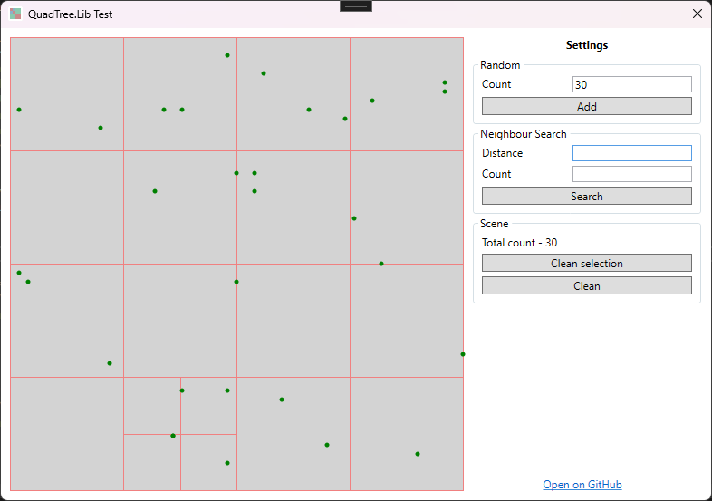
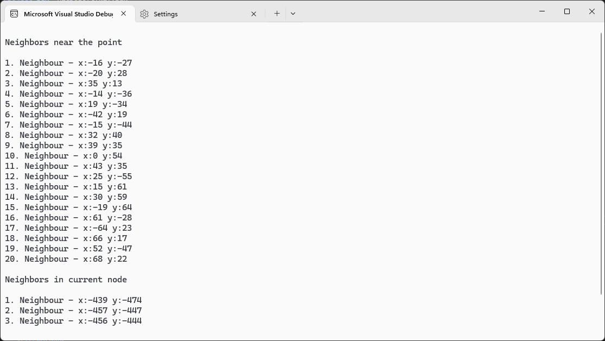

<div style="width: 100%;display: flex;justify-content: center;flex-direction: column;align-items: center;">
	
	<h1>QuadTree C#</h1>
</div>

## Table of context

1. [Install](#install)
2. [Example](#example)
3. [TODO](#todo)
4. [Demo](#demo)
5. [Resources](#resources)
 
## Install

[NuGet.org](https://www.nuget.org/packages/QuadTree.Lib/)

```c#
Install-Package QuadTree.Lib
```

## Example

```c#
using QuadTree.Lib;
using QuadTree.Lib.Interfaces;

class Item(float x, float y) : IQuadTreeItem
{
	public float X { get; set; } = x;
	public float Y { get; set; } = y;
	public IQuadTreeNode? ParentNode { get; set; }
}

class Program
{
	static void Main(string[] args)
	{
		var halfWidth = 500;
		// create a quad tree with node size equal to 10
		var quadTree = new QuadTree<Item>(0, 0, halfWidth, 10);

		Random random = new Random();
		// insert 1000 random items
		for (int i = 0; i < 1000; i++)
		{
			quadTree.Insert(new Item(random.Next(-halfWidth, halfWidth), random.Next(-halfWidth, halfWidth)));
		}

		var iterator = 0;

		// find neighbors near the zero point within a radius of 100 and contain a maximum number of 20
		Console.WriteLine("\nNeighbors near the point\n");
		iterator = 0;
		var neighbours = quadTree.QueryNeighbours(0, 0, 100, 20);
		neighbours.ToList().ForEach(n => Console.WriteLine($"{++iterator}. Neighbour - x:{n.X} y:{n.Y}"));

		// get neighbors in current node
		Console.WriteLine("\nNeighbors in current node\n");
		iterator = 0;
		var item = quadTree.First();
		quadTree.GetOnNode(item).ToList().ForEach(n => Console.WriteLine($"{++iterator}. Neighbour - x:{n.X} y:{n.Y}"));
	}
}
```

## TODO

 - [ ] Add summary
 - [ ] Add docs
 - [ ] Add some methods for QuadTree
	- [ ] Normalize
	- [ ] etc..
 - [ ] Change render in test application

## Demo

<div style="width: 100%;display: flex;justify-content: center;flex-direction: column;align-items: center;">
	
	<i>QuadTree C#</i>
</div>

<div style="width: 100%;display: flex;justify-content: center;flex-direction: column;align-items: center;">
	
	<i>QuadTree C#</i>
</div>

## Resources

1. Wikipedia - [QuadTree](https://en.wikipedia.org/wiki/Quadtree)
1. Based on [QuadTreePoint](https://github.com/hightower70/QuadtreePoint)